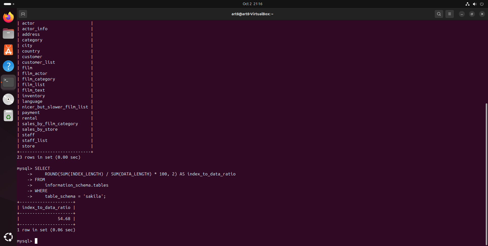
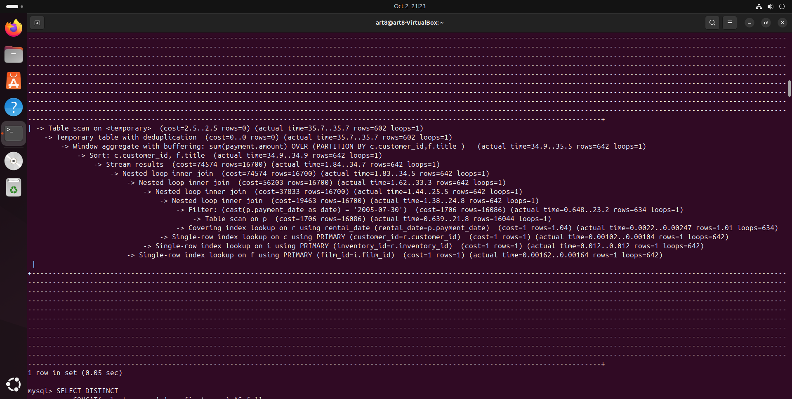
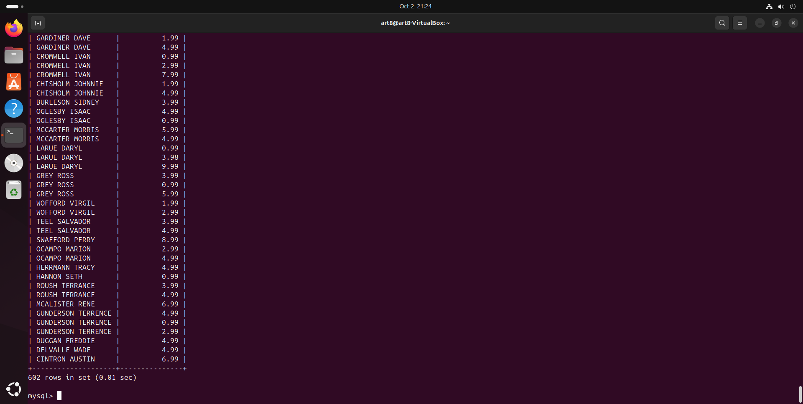

# Домашнее задание Index

## Задание 1
Запрос: 

SELECT ROUND(SUM(INDEX_LENGTH) / SUM(DATA_LENGTH) * 100, 2) AS index_to_data_ratio  
FROM information_schema.tables  
WHERE table_schema = 'sakila';



## Задание 2

### Исходный запрос и узкие места

Запрос: 

SELECT DISTINCT  
    CONCAT(c.last_name, ' ', c.first_name),  
    SUM(p.amount) OVER (PARTITION BY c.customer_id, f.title)  
FROM payment p, rental r, customer c, inventory i, film f  
WHERE DATE(p.payment_date) = '2005-07-30'  
AND p.payment_date = r.rental_date  
AND r.customer_id = c.customer_id  
AND i.inventory_id = r.inventory_id;

**Узкие места:**

1. **Table scan на таблице `payment`**: Полное сканирование таблицы `payment` из-за использования `DATE(p.payment_date)`, что мешает использовать индекс на колонке `payment_date`.
2. **Window aggregate**: Оконная функция `SUM(p.amount) OVER (PARTITION BY c.customer_id, f.title)` требует буферизации данных и сортировки, что добавляет задержки.
3. **Временные таблицы и сортировка**: Использование временной таблицы и сортировки также замедляет запрос.



### Оптимизация

1. Улучшаем фильтрацию по дате, заменяя `DATE(p.payment_date)` на диапазон:
   
   ```sql
   WHERE p.payment_date >= '2005-07-30 00:00:00' 
   AND p.payment_date < '2005-07-31 00:00:00';
  ```

2. Добавляем индексы на ключевые колонки для улучшения производительности соединений:

CREATE INDEX idx_payment_date ON payment(payment_date);
CREATE INDEX idx_rental_date ON rental(rental_date);
CREATE INDEX idx_customer_id ON customer(customer_id);
CREATE INDEX idx_inventory_id ON inventory(inventory_id);
CREATE INDEX idx_film_id ON film(film_id);


Оптимизированный запрос:

SELECT DISTINCT 
    CONCAT(c.last_name, ' ', c.first_name) AS full_name, 
    SUM(p.amount) OVER (PARTITION BY c.customer_id, f.title) AS total_payment
FROM 
    payment p
JOIN 
    rental r ON p.payment_date = r.rental_date
JOIN 
    customer c ON r.customer_id = c.customer_id
JOIN 
    inventory i ON r.inventory_id = i.inventory_id
JOIN 
    film f ON i.film_id = f.film_id
WHERE 
    p.payment_date >= '2005-07-30 00:00:00' 
    AND p.payment_date < '2005-07-31 00:00:00';

#



